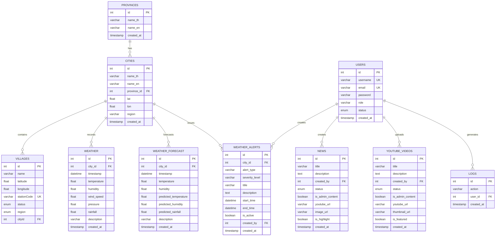

# Database ERD - Weather Web Application

นี่คือ Entity Relationship Diagram (ERD) ของฐานข้อมูลสำหรับ Weather Web Application

## คำอธิบายความสัมพันธ์

### ความสัมพันธ์หลัก:
1. **PROVINCES → CITIES** (1:N): จังหวัดหนึ่งมีหลายเมือง
2. **CITIES → VILLAGES** (1:N): เมืองหนึ่งมีหลายหมู่บ้าน/ชุมชน
3. **CITIES → WEATHER** (1:N): เมืองหนึ่งมีข้อมูลสภาพอากาศหลายรายการ
4. **CITIES → WEATHER_FORECAST** (1:N): เมืองหนึ่งมีการพยากรณ์อากาศหลายรายการ
5. **CITIES → WEATHER_ALERTS** (1:N): เมืองหนึ่งมีการแจ้งเตือนสภาพอากาศหลายรายการ
6. **USERS → NEWS** (1:N): ผู้ใช้หนึ่งคนสร้างข่าวได้หลายข่าว
7. **USERS → YOUTUBE_VIDEOS** (1:N): ผู้ใช้หนึ่งคนสร้างวิดีโอได้หลายวิดีโอ
8. **USERS → WEATHER_ALERTS** (1:N): ผู้ใช้หนึ่งคนสร้างการแจ้งเตือนได้หลายรายการ
9. **USERS → LOGS** (1:N): ผู้ใช้หนึ่งคนมีการบันทึกการกระทำหลายรายการ
8. **CITIES → WEATHER_ALERTS** (1:N): เมืองหนึ่งมีการแจ้งเตือนสภาพอากาศหลายรายการ
9. **USERS → WEATHER_ALERTS** (1:N): ผู้ใช้หนึ่งคนสร้างการแจ้งเตือนสภาพอากาศได้หลายรายการ

### ตารางหลัก:
- **PROVINCES**: เก็บข้อมูลจังหวัดในประเทศลาว
- **CITIES**: เก็บข้อมูลเมือง/อำเภอ พร้อมพิกัดทางภูมิศาสตร์
- **VILLAGES**: เก็บข้อมูลหมู่บ้าน/ชุมชน และสถานีวัดอากาศ
- **WEATHER**: เก็บข้อมูลสภาพอากาศปัจจุบัน
- **WEATHER_FORECAST**: เก็บข้อมูลพยากรณ์อากาศจาก ML Model
- **WEATHER_ALERTS**: เก็บข้อมูลการแจ้งเตือนสภาพอากาศอันตราย (พายุ, น้ำท่วม, ฝนตกหนัก)
- **NEWS**: เก็บข้อมูลข่าวสาร
- **YOUTUBE_VIDEOS**: เก็บข้อมูลวิดีโอ YouTube
- **USERS**: เก็บข้อมูลผู้ใช้และผู้ดูแลระบบ
- **LOGS**: เก็บประวัติการใช้งานระบบ
- **WEATHER_ALERTS**: เก็บข้อมูลการแจ้งเตือนสภาพอากาศ
